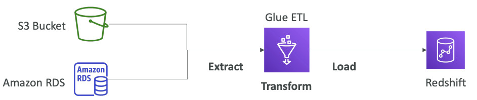

## Amazon EC2

It mainly consists in the capability of :
• Renting virtual machines (EC2)
• Storing data on virtual drives (EBS)
• Distributing load across machines (ELB)
• Scaling the services using an auto-scaling group (ASG)


## Amazon S3

Amazon S3 is one of the main building blocks of AWS
• It’s advertised as ”infinitely scaling” storage
• Many websites use Amazon S3 as a backbone
• Many AWS services use Amazon S3 as an integration as well
• We’ll have a step-by-step approach to S3
• The CCP exam requires “deeper” knowledge about S3


S3 Use cases • Backup and storage • Disaster Recovery • Archive • Hybrid Cloud storage • Application hosting • Media hosting • Data lakes & big data analytics • Software delivery • Static website

### Amazon Redshift vs. Amazon S3
Amazon Redshift is a data warehouse, while Amazon S3 is object storage. While some businesses may use one over the other, the question of Redshift vs. S3 is not an either/or situation. Many will choose to use both of them at once. 

In short, Amazon S3 vs. Redshift can be thought of as allowing for unstructured vs. structured data.

As a data warehouse, Redshift requires the data that it works with to be appropriately structured to serve as an effective environment for BI tools and SQL-based clients who utilize standard JDBC and ODBC connections. 
Meanwhile, Amazon S3 can receive and work with any data size or structure, and the data does not have to have a stated or defined purpose from the get-go. S3 provides a specialized space for exploring data and discovering new innovations that can lead to enhanced opportunities for data analysis.


### Buckets
Amazon S3 allows people to store objects (files) in “buckets” (directories)
• Buckets must have a globally unique name (across all regions all accounts)
• Buckets are defined at the region level
• S3 looks like a global service but buckets are created in a region

### Objects
• Objects (files) have a Key 
• The key is the FULL path:
• s3://my-bucket/my_file.txt 
• s3://my-bucket/my_folder1/another_folder/my_file.txt 
• The key is composed of prefix + object name 
    • s3://my-bucket/my_folder1/another_folder/my_file.txt • There’s no concept of “directories” within buckets
(although the UI will trick you to think otherwise)
• Just keys with very long names that contain slashes (“/”)


##AWS Glue

- Managed extract, transform, and load (ETL) service 
- Useful to prepare and transform data for analytics 
- • Fully serverless service 
- 


## Amazon SageMaker
- Fully managed service for developers / data scientists to build ML models 
- ypically, difficult to do all the processes in one place + provision servers


## IAM 
The main concepts in IAM are:
- **Users:** Users are entities that represent a person or a service/application ( like in the case of Service Accounts)
- **Groups**: Groups are **collections of users and have policies attached to them**. They help organise users (into departments or functions - like developers or admins) and **simplify access management at scale,** because when you need to add or remove policies that change is automatically applied to all users in that group.
- **Roles:** Roles can be assumed by trusted entities - a user or a service can assume a role to obtain temporary security credentials. similar to an IAM user, but is not associated with a specific person.
- **Access Policies**: a JSON document define permissions.

```json
{
   "Version": "2012-10-17",
   "id": "S3-permission" //optional, an identifier for the policy
   "Statement": [
     {
       "Sid": "DenyS3AccessWithNoMFA", //optional, an identifier for the statement
       "Effect": "Deny", // or "Allow"
       "Principal": "*", // account or user or role to which this policy applied to
       "Action": "s3:*", // list of actions this policy allows or denies
       "Resource": "arn:aws:s3:::this-is-an-example-s3-bucket-name/example-directory/*",
       "Condition": { "Null": { "aws:MultiFactorAuthAge": true }}  // optional, when the policy should be applied
     }
   ]
}
```